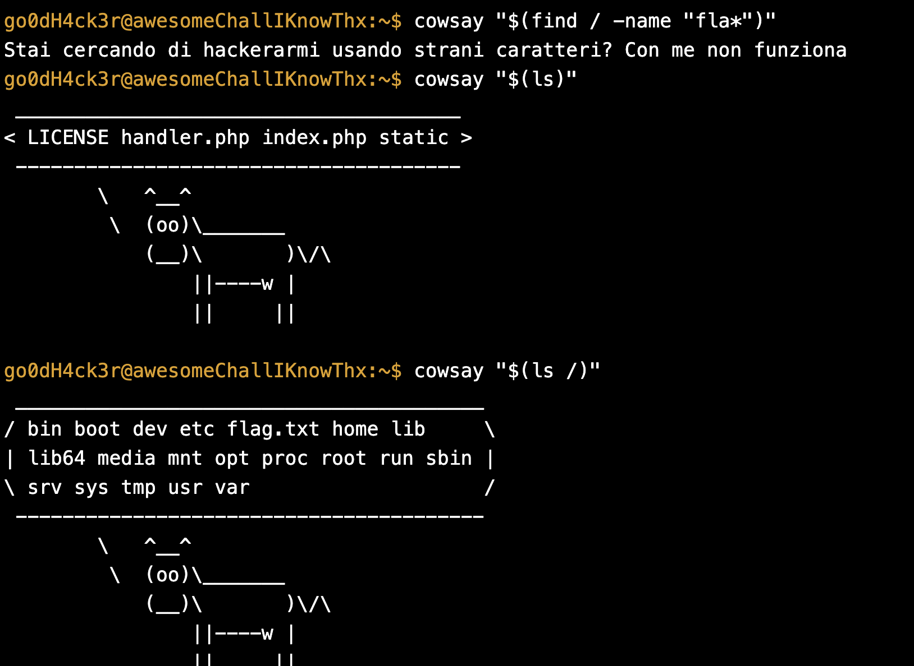
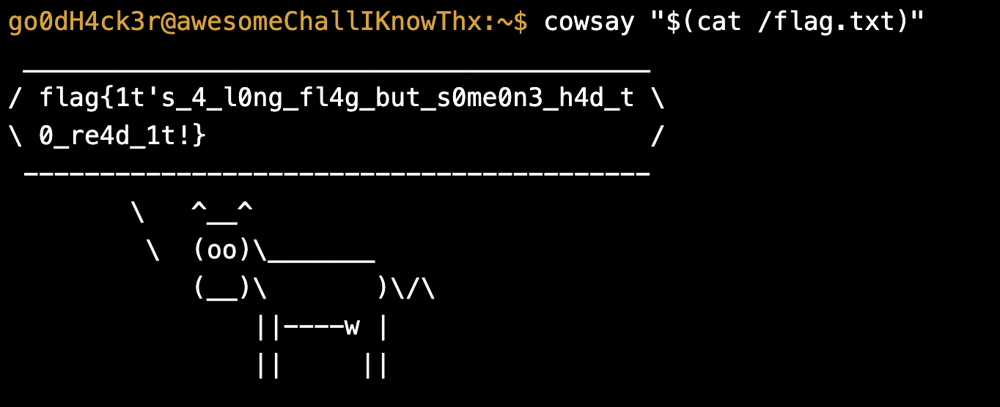

### TIMP - Overcoming Character Blacklists with Variable Substitution

Real-world applications frequently employ rudimentary defenses, commonly implementing character blacklists designed to intercept known malicious payloads. The TIMP challenge, hosted on the OliCyber Training platform at [https://training.olicyber.it/challenges#challenge-50](https://www.google.com/search?q=https://training.olicyber.it/challenges%23challenge-50), illustrates the fragility of this defensive approach. The interface mimics a terminal emulator that transmits user input via the `cmd` parameter to a backend `handler.php` script. The intended functionality is to invoke the `cowsay` executable to display a user-provided message.

Analyzing the source code reveals a filter with multiple execution branches. The primary branch responsible for executing the `cowsay` binary permits spaces, and while it utilizes functions like `addslashes`, it critically fails to sanitize command substitution syntax. Attackers can leverage the dollar sign and parentheses to instruct the shell to execute an embedded command and substitute its standard output directly into the outer command.



```Bash
cowsay "$(cat /flag.txt)"
```




Alternatively, the application contains a secondary fallback branch that enforces a strict ten-character length limitation and implements a regex-based blacklist specifically targeting literal spaces. Bypassing this restriction requires leveraging environmental variables inherent to the operating system shell. The Internal Field Separator variable determines how the shell dictates word boundaries, defaulting to spaces, tabs, and newlines. By injecting `${IFS}` wherever a space is syntactically required, the payload evades the literal-space blacklist. The shell dynamically expands the variable before execution, restoring the necessary spaces for the command to parse correctly. Due to the severe length restriction, the attacker must exfiltrate the target file in discrete chunks utilizing string manipulation utilities.


```Bash
cut${IFS}-c1-10${IFS}/flag.txt
```

> **Key Takeaway:** Implementing character blacklists in front of a shell execution sink is fundamentally ineffective, as the operating system provides numerous substitution and expansion mechanics, such as variable expansion and command substitution, capable of transparently reconstructing blocked characters dynamically at runtime.


