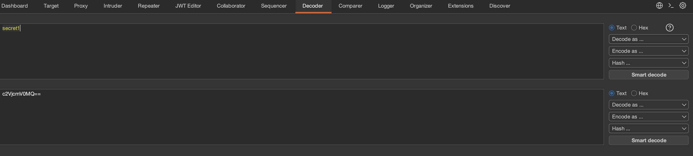
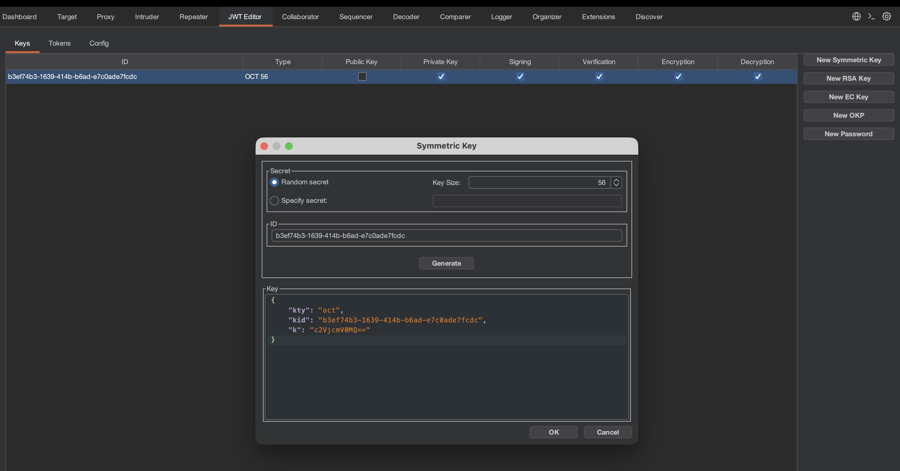
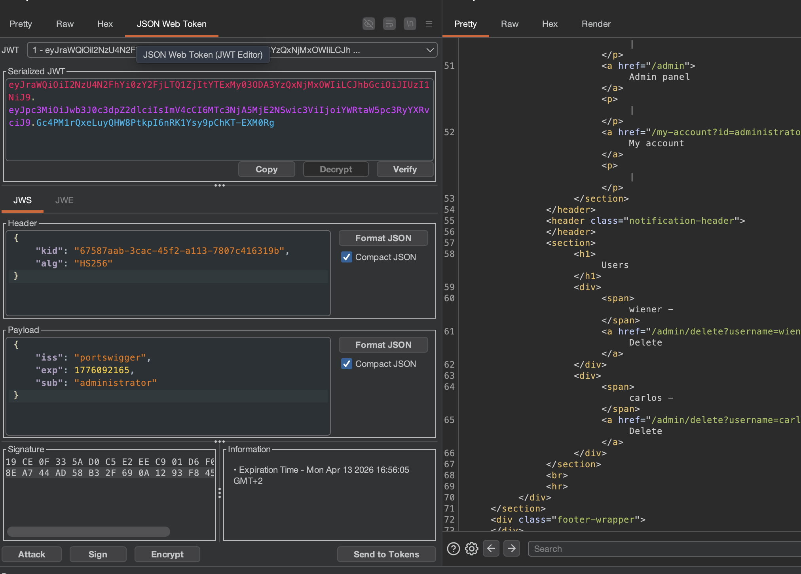

## JWT Authentication Bypass via Weak Symmetric Keys

### Cryptographic Weakness and Offline Brute-Forcing

The core vulnerability in this environment stems from the use of a predictable, low-entropy secret key used in a symmetric signing algorithm, most commonly **HMAC-SHA256**. Unlike the previous discussion regarding algorithm manipulation, the server here correctly requires a signature, however, the security of that signature relies entirely on the secrecy of the key. If the key is weak, an attacker can perform an offline dictionary attack to recover it.

> **Symmetric Signing** involves a single shared secret used by the server to both create the signature and verify it later. In a JWT context, the signature is a hash of the header and payload, keyed with this secret.

To initiate the exploitation, the practitioner identifies the JWT within the session cookie after authenticating as a standard user. By attempting to access the `/admin` endpoint and receiving a rejection, the authorization boundary is confirmed. The attack then moves to **Hashcat**, a specialized tool designed for high-performance password recovery. The practitioner uses mode `16500`, which is specifically optimized for JWT signatures, to compare the signature of the captured token against hashes generated from a wordlist of common secrets.

```sh
hashcat -a 0 -m 16500 <YOUR-JWT> <list-of-secrets>
```
[list-of-secrets](https://github.com/wallarm/jwt-secrets/blob/master/jwt.secrets.list)

The recovery of the string `secret1` demonstrates a catastrophic failure in key management, as the key is easily guessable and present in standard wordlists. Because this process happens locally on the attacker's machine, the server remains unaware that its primary cryptographic secret has been compromised.

### Forging Identities with the JWT Editor

Once the secret key is recovered, the practitioner possesses the same signing authority as the backend server. To effectively use this key within the penetration testing workflow, the **JWT Editor** extension in Burp Suite is utilized to manage cryptographic material.

The process requires converting the plaintext secret into a format suitable for the application. The practitioner first encodes the string `secret1` into **Base64**, then navigates to the JWT Editor Keys tab to create a **New Symmetric Key**. By replacing the `k` property (which represents the key value in a JSON Web Key structure) with the Base64-encoded secret, the extension is primed to generate valid signatures that the server will trust.

<div class="two-col">
<div>




</div>	
<div>




</div>
</div>


### Elevation of Privilege and Administrative Execution

With the forged signing key integrated into the toolkit, the practitioner returns to the Repeater tool to manipulate the token claims. The `sub` claim, which acts as the unique identifier for the session, is modified from `wiener` to `administrator`.


<div class="two-col">
<div>

To ensure the server accepts this modified payload, the practitioner uses the **Sign** function at the bottom of the JSON Web Token tab, selecting the previously created symmetric key. It is vital to ensure the header remains unmodified if the server expects a specific algorithm like HS256. Upon signing, the extension recomputes the third segment of the JWT using the `secret1` key and the new `administrator` payload.


</div>	
<div>



</div>
</div>

```json
{
  "sub": "administrator",
  "iat": 1516239022
}
```

The final submission of this forged token results in the server successfully validating the signature against its internal secret, granting the practitioner administrative access. The practitioner then identifies the management endpoint within the rendered HTML and issues a request to `/admin/delete?username=carlos`, leveraging the forged identity to perform a high-impact administrative action and complete the objective.